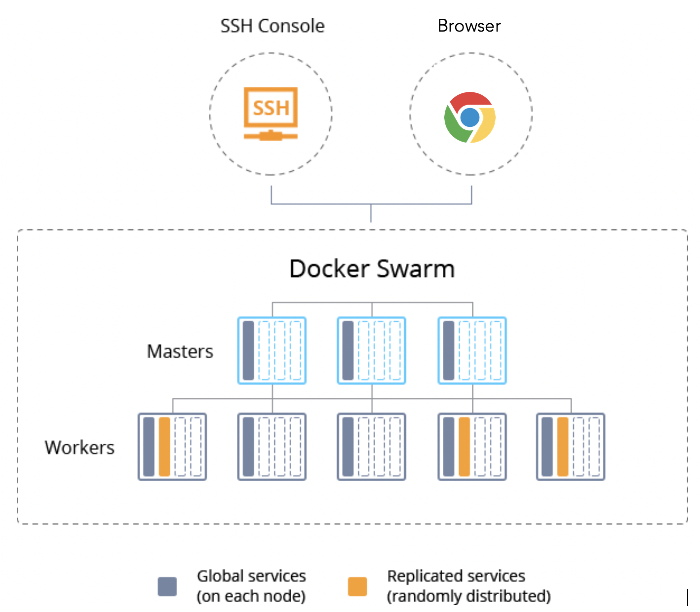
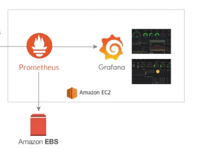

# Devops Project

## App documentation
We want to develop an API in charge of managing a cipher queue (which we will call job).
This API exposes several routes:

- GET / jobs: returns the array of jobs (ex: [5,4,3,2,1])
- POST / jobs: accepts a JSON in the format `{" input ": number}` and adds the number in the queue **if it is not already present inside the queue** (ex: ` {"input": 12} `)
- GET / job: returns the first job in the queue (and updates the queue) (ex: 12)
- DELETE / jobs: empty the queue if the queue is empty, we return an HTTP 204 status and no output

## Stack
NodeJs, Express, Docker, GithubActions, AWS EC2, Prometheus, Grafana

## Requirements
A compute node containing
* Docker 
* Docker-compose

## Running the solution
Use this command to run the solution
```bash
sudo docker stack deploy --compose-file docker-compose.yml devops
```
After running the container you can check these ports:

|||
|----|---|
|8000|Node application|
|9090|Prometheus|
|3000|Graphana|
## Architechture
We use EC2 as nodes in the docker swarm setup, the replicas specified in the deployment stack is distributed randomly among nodes.

We use another node to host monitoring apps and data.

## Deployment strategy
For deployment, we use the "Rolling Update" strategy to allow updates to take place with 
zero downtime. This is achieved by incrementally updating replicas with new ones
with a 10-second delay.
The new replicas will be deployed on Nodes with available resources.
The deployment is updated automatically in the CD workflow job.
```bash
docker service rollback devops
```
The service will go back to the version that was deployed just before an update.
## CI/CD
### CI
* Install dependencies
* Run tests on multiple versions of NodeJs
### CD
* Login to docker hub
* Build image
* Push image
* Deploy latest image to nodes

To run the CD workflow, make sure to configure the following secrets
* DOCKER_REPO
* DOCKER_USER
* DOCKER_PASS
* DEPLOY_HOST
* AWS_PEM
